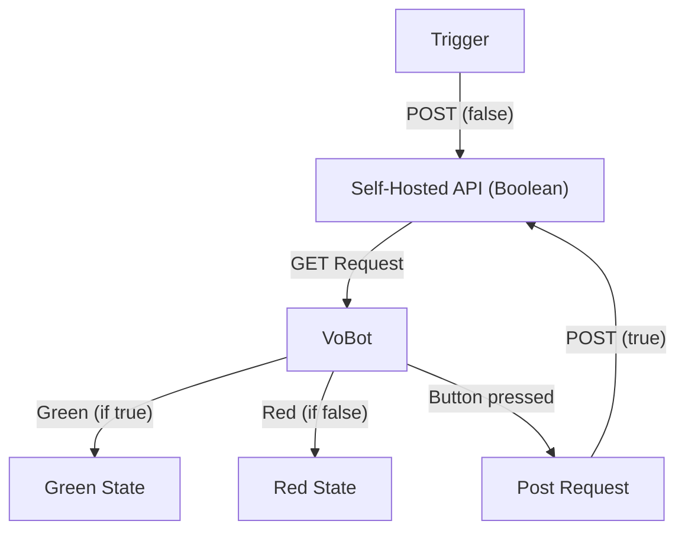

# **1. Project Description**  
**Vobot Ticket Alarm** is a holiday project that uses the Vobot MiniDock to indicate the status of an API (true or false). This can be used for various applications, such as an alarm system.

# **2. Dependencies (Requirements)**  
- Vobot MiniDock  
- Self-hosted API service that can be either true or false  
- Python (MicroPython)  
- lvgl Library  
- urequests Library  
- peripherials Library  

# **3. Architecture Overview**  
The project consists of the following main components:
```
├── Alarm
│   ├── __init__.py        # MicroPython application logic
│   ├── manifest.yml       # Metadata for initializing the app
│   └── resources          # Assets for display and UI
│       ├── false.jpg      # Image shown when bool on API == false
│       ├── icon.png       # App icon
│       └── true.jpg       # Image shown when bool on API == true
├── server.js              # API server logic
└── README.md              # Project documentation
```

# **4. System Structure**

# **5. Installation**  
To install and configure the Vobot system, please follow the official guide at [dock.myvobot.com](https://dock.myvobot.com/developer/getting_started/).  

Steps:  
1. Install [Thonny](https://thonny.org/)  
2. Connect to ESP32  
3. Copy the `App` folder to the ESP32  
4. Execute `manifest.yml`  

# **6. Setting Up the API**
The API is a self-hosted **Node.js Express API** that provides a boolean status (`true` or `false`), which can be updated via HTTP requests.

### **6. Setting Up the API**

1. **Install Dependencies**
  - Ensure Node.js is installed.
  - Run `npm install` in the API directory.

2. **Start the API**
  - Copy `server.js` to your desired location.
  - Run `node server.js`.
  - The server listens on **port 4000**.

# **7. API Endpoints**
### **7.1 Get Ticket Status**
- **GET** `/api/ticket-status`
- **Response:**
  ```json
  {
   "status": false
  }
  ```

### **7.2 Update Ticket Status**
- **POST** `/api/ticket-status`
- **Request Body:**
  ```json
  {
   "status": true
  }
  ```
- **Response:**
  ```json
  {
   "message": "Status updated successfully",
   "status": true
  }
  ```
- **Error:**
  ```json
  {
   "error": "Invalid status value"
  }
  ```

# **8. Usage / Testing**
- When the API returns `true`, the light/display turns **green**.
- When the API returns `false`, the light/display turns **red**.
- If the Vobot is **red**, it can be reset to **green** by pressing the button.

# **9. Manually Updating API Boolean (POST Request)**  
The project uses a **self-hosted API** that maintains a boolean value (`true` or `false`).  

### **9.1 Using cURL (Linux/macOS/Windows)**
```sh
curl -X POST https://your-api.com/api/ticket-status -H "Content-Type: application/json" -d '{"status": false}'
curl -X POST https://your-api.com/api/ticket-status -H "Content-Type: application/json" -d '{"status": true}'
```
### **9.2 Using PowerShell (Windows)**
```powershell
Invoke-WebRequest -Uri "https://your-api.com/api/ticket-status" -Method POST -Headers @{ "Content-Type" = "application/json" } -Body '{"status": false}'
Invoke-WebRequest -Uri "https://your-api.com/api/ticket-status" -Method POST -Headers @{ "Content-Type" = "application/json" } -Body '{"status": true}'
```

# **10. License**
This project is licensed under the ISC License.
